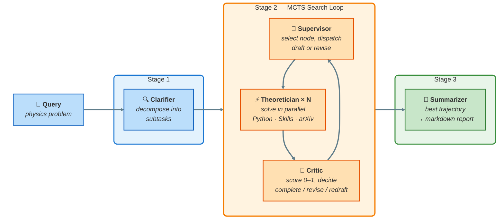

<div align="center">
<br>

<h1>🔬 PhysMaster</h1>

<p><strong>Solve physics problems with LLM-driven Monte Carlo Tree Search</strong></p>

<p>
<a href="https://python.org"></a>&nbsp;
<a href="#-quick-start"></a>&nbsp;
<a href="LICENSE"></a>&nbsp;
<a href="https://arxiv.org"></a>
</p>

<p>
<a href="README_CN.md">中文文档</a>&nbsp;&nbsp;|&nbsp;&nbsp;<a href="extensions/README.md">Extensions</a>&nbsp;&nbsp;|&nbsp;&nbsp;<a href="feishu/README.md">Feishu Bot</a>
</p>

<br>
</div>

PhysMaster decomposes a physics problem into subtasks, explores multiple solution strategies **in parallel** through an MCTS search tree, evaluates and refines them with a Critic, and distills reusable knowledge &mdash; from a single node all the way up to a cross-task wisdom store.

---

## 🏗 Architecture



<table>
<tr>
<td>

**Agent** | **Role**
:--|:--
🔍 **Clarifier** | Parse problem into structured subtasks
🎯 **Supervisor** | Read tree context, pick next subtask, decide draft vs. revise
⚡ **Theoretician** | Solve subtask with Python, skills, arXiv, prior knowledge
🧪 **Critic** | Score solution (0&ndash;1): `complete` · `to_revise` · `to_redraft`
📄 **Summarizer** | Extract best trajectory, write markdown report

</td>
</tr>
</table>

> **The loop stops** when all subtasks are completed along some path, or the round budget runs out.

---

## 🚀 Quick Start

> **Prerequisites:** Python 3.10+, an OpenAI-compatible LLM API key

<table>
<tr>
<td>

**1. Install**

```bash
git clone https://github.com/AdrianMiao27/PHY_Master.git
cd PHY_Master
pip install -r requirements.txt
```

</td>
<td>

**2. Configure**

```yaml
# config.yaml
llm:
  base_url: "https://api.openai.com/v1"
  api_key: "sk-..."
  model: "gpt-4o"
```

</td>
</tr>
</table>

**3. Write your problem** in a text file (LaTeX is fine):

```
instructions/my_problem.txt
```

**4. Run:**

```bash
python run.py                    # default config.yaml
python run.py -c custom.yaml     # custom config
```

**5. Check results** in `outputs/<task_name>/`:

```
outputs/<task_name>/
 ├─ contract.json            Structured problem decomposition
 ├─ summary.md               Final solution report
 ├─ visualization.html       Interactive MCTS tree (open in browser)
 ├─ log/                     Detailed logs (if debug_logging enabled)
 │   ├─ round_0.json           Round-level dispatch decisions
 │   ├─ node_1/
 │   │   └─ node_log.json      Input/output/evaluation for node 1
 │   └─ summary.json           Tree statistics
 ├─ node_1/                  Theoretician working directory for node 1
 ├─ node_2/                  ...
 └─ ...
```

> 💡 **Minimal mode** &mdash; run without external knowledge: set `skills.enabled: false` and all `landau.*_enabled: false`.

---

## ⚙ Configuration

All behavior lives in `config.yaml`. Only `llm` and `pipeline.query_file` are required.

<details>
<summary><b>📄 Full config with comments</b> (click to expand)</summary>

```yaml
# ── LLM ──────────────────────────────────────────────
llm:
  base_url: "https://api.openai.com/v1"
  api_key: "sk-..."
  model: "gpt-4o"

# ── Pipeline ─────────────────────────────────────────
pipeline:
  query_file: "instructions/test.txt"
  output_path: "outputs"
  max_rounds: 10              # MCTS round budget
  parallel_processes: 2       # concurrent Theoretician workers
  debug_logging: false        # detailed per-node logs in outputs/<task>/log/

# ── MCTS ─────────────────────────────────────────────
mcts:
  draft_expansion: 2          # children per draft expansion
  revise_expansion: 1         # children per revise expansion
  exploration_constant: 1.414 # UCB1 exploration weight (sqrt 2)
  active_beam_width: 0        # 0 = no pruning; N = keep top-N per depth

# ── Clarifier ────────────────────────────────────────
clarifier:
  max_key_concpets: 5

# ── Skills ───────────────────────────────────────────
skills:
  enabled: true
  roots:
    - "LANDAU/skills"

# ── LANDAU knowledge modules ─────────────────────────
landau:
  library_enabled: true       # arXiv paper search
  library: "LANDAU/library"
  workflow_enabled: true       # problem-solving templates
  workflow: "LANDAU/workflow"
  prior_enabled: true          # FAISS RAG knowledge base
  prior: "LANDAU/prior"
  wisdom_save_enabled: false   # persist distilled wisdom after each task

# ── Visualization ────────────────────────────────────
visualization:
  enabled: true
```

</details>

**Key parameters:**

| Key | Description | Default |
|:----|:------------|:-------:|
| `pipeline.max_rounds` | Total MCTS iterations before forced stop | `10` |
| `pipeline.parallel_processes` | Theoretician subprocesses | `2` |
| `pipeline.debug_logging` | Write detailed per-node JSON logs | `false` |
| `mcts.draft_expansion` | Child nodes per draft round | `2` |
| `mcts.revise_expansion` | Child nodes per revise round | `2` |
| `mcts.exploration_constant` | UCB1 exploration term | `1.414` |
| `mcts.active_beam_width` | Beam pruning width (0 = off) | `0` |

---

## 🌳 MCTS Search

PhysMaster does **not** solve linearly. It maintains a tree of solution attempts and navigates it like a game:

| Step | What happens |
|:-----|:-------------|
| **Select** | UCB1 picks the most promising leaf, balancing reward vs. exploration |
| **Expand** | N Theoretician workers spawn **in parallel** and produce child nodes |
| **Evaluate** | Critic scores each child on a 0&ndash;1 scale |
| **Backpropagate** | Reward flows upward; high-reward nodes (&gt;0.8) reinforce ancestors with verified knowledge |
| **Prune** | If beam width is set, low-reward nodes beyond the budget are closed |

The search terminates when a complete path is found or `max_rounds` is hit. The best root-to-leaf path is extracted for the summary.

---

## 🧠 Memory System

The search tree carries knowledge forward at **three scopes**:

<table>
<tr>
<td width="33%" align="center">

**🔬 Per-Node Experience**

Full Theoretician output: reasoning, tool calls, code. Available to the Critic for evaluation, then compressed into knowledge.

</td>
<td width="33%" align="center">

**📦 Compressed Knowledge**

Distilled summary attached to each node after evaluation. Ancestors and siblings share insights through the tree context.

</td>
<td width="33%" align="center">

**🌐 Cross-Task Wisdom**

After a task completes, the best trajectory is distilled and written back to the FAISS index for future tasks to retrieve.

</td>
</tr>
</table>

> High-reward nodes (&gt;0.8) trigger **cognitive reinforcement**: their verified knowledge is propagated to ancestor nodes during backpropagation, strengthening context quality for future expansions.

---

## 📚 Prior Knowledge (RAG)

`LANDAU/prior/` provides a full retrieval-augmented generation pipeline:

| Stage | File | What it does |
|:------|:-----|:-------------|
| **Ingest** | `prior_store.py` | PDF / Markdown / Text &rarr; parent-child chunks &rarr; `bge-small-en-v1.5` embeddings &rarr; FAISS index |
| **Retrieve** | `prior_retrieve.py` | Dense + BM25, fused with Reciprocal Rank Fusion, then weighted reranking |
| **Wisdom** | `wisdom_store.py` | Post-task LLM distillation &rarr; new chunk appended to the same index |

**Pre-built knowledge base**: [PhysLib on HuggingFace](https://huggingface.co/datasets/Kev1n-J1N/PhysLib) — 78k chunks from 74 physics textbooks (Landau & Lifshitz, Weinberg QFT, String Theory, Condensed Matter, GR/Cosmology, etc.)

<details>
<summary><b>Ingestion commands</b></summary>

```bash
# place source files in LANDAU/prior/source/, then:
python LANDAU/prior/prior_store.py                             # ingest all
python LANDAU/prior/prior_store.py --target path/to/file.pdf   # single file
python LANDAU/prior/prior_store.py --reset                     # full rebuild
```

</details>

```yaml
landau:
  prior_enabled: true
  wisdom_save_enabled: true   # optional: persist cross-task wisdom
```

---

## 🔧 Skills & Workflow

### Skills

Domain knowledge packages in `LANDAU/skills/`. The Theoretician sees a brief of all installed skills and can load any on demand.

<details>
<summary><b>12 built-in skills</b> (click to expand)</summary>

| Skill | Coverage |
|:------|:---------|
| Classical Electrodynamics | Maxwell's equations, radiation, waveguides |
| Quantum Mechanics | Schrodinger equation, scattering, angular momentum |
| Thermodynamics & Statistical Mechanics | Partition functions, phase transitions, ensembles |
| Conservation Laws | Noether's theorem, conserved currents |
| Perturbation Expansion | Regular/singular perturbation, asymptotic series |
| Variational Methods | Euler-Lagrange, Rayleigh-Ritz |
| Dimensional Analysis | Pi theorem, natural units, scaling laws |
| Symmetry Analysis | Group theory, Lie algebras, representations |
| Fourier & Spectral Analysis | Fourier/Laplace transforms, spectral methods |
| Numerical ODE/PDE | Runge-Kutta, finite difference/element |
| Statistical Error Analysis | Error propagation, fitting, Monte Carlo |
| LaMET Asymptotic Expansion | Large-momentum effective theory |

</details>

### Workflow Templates

YAML files in `LANDAU/workflow/` that define structured solving strategies. The Clarifier matches a template by keyword overlap with its Goal field.

---

## 📁 Project Structure

```
PHY_Master/
│
├── run.py                       Entry point
├── config.yaml                  Configuration
├── requirements.txt
│
├── core/                        Core pipeline
│   ├── clarifier.py               Query → structured contract
│   ├── supervisor.py              MCTS orchestrator
│   ├── mcts.py                    MCTSNode / MCTSTree
│   ├── theoretician.py            Solver agent (subprocess)
│   ├── summarizer.py              Trajectory → markdown report
│   └── visualization.py           Tree → interactive HTML
│
├── LANDAU/                      Knowledge modules
│   ├── skills/                    12 built-in physics skills
│   ├── workflow/                  Problem-solving YAML templates
│   ├── library/                   arXiv paper search & retrieval
│   └── prior/                     FAISS RAG knowledge base
│       ├── prior_store.py           Ingestion pipeline
│       ├── prior_retrieve.py        Hybrid retriever
│       └── wisdom_store.py          Cross-task wisdom persistence
│
├── utils/                       Utilities
│   ├── llm_client.py              OpenAI-compatible API wrapper
│   ├── python_utils.py            Subprocess code execution
│   ├── skill_loader.py            SKILL.md discovery & loading
│   └── tool_schemas.py            Tool definitions
│
├── prompts/                     14 prompt templates (7 agents)
├── instructions/                Query files
├── extensions/                  Skill plugins for CC / OpenClaw
├── feishu/                      Feishu bot integration
└── outputs/                     Generated at runtime
```

---

## 🔌 Integrations

### Feishu Bot

PhysMaster can run as a **Feishu (Lark) chatbot**. Send a physics problem in chat &rarr; bot replies "solving..." &rarr; pipeline runs in a background thread &rarr; summary is pushed back when done.

See **[feishu/README.md](feishu/README.md)** for setup.

### Use as a Skill (Claude Code / OpenClaw)

PhysMaster can be installed as a **skill plugin** for AI agent platforms:

<table>
<tr>
<td width="50%">

**Claude Code**

```bash
bash extensions/skills/physmaster/install_cc.sh
```

Then use `/physmaster` in any session.

</td>
<td width="50%">

**OpenClaw**

```bash
bash extensions/skills/physmaster/install_openclaw.sh \
  /path/to/skills
```

Then `use_skill(name="physmaster", ...)` in agents.

</td>
</tr>
</table>

See **[extensions/README.md](extensions/README.md)** for details.

---

## 💬 Community

Join our WeChat group to discuss physics problem solving, share results, and get help:

<div align="center">

<p><i>Scan to join the WeChat group</i></p>
</div>

---

## License

[MIT](LICENSE)
