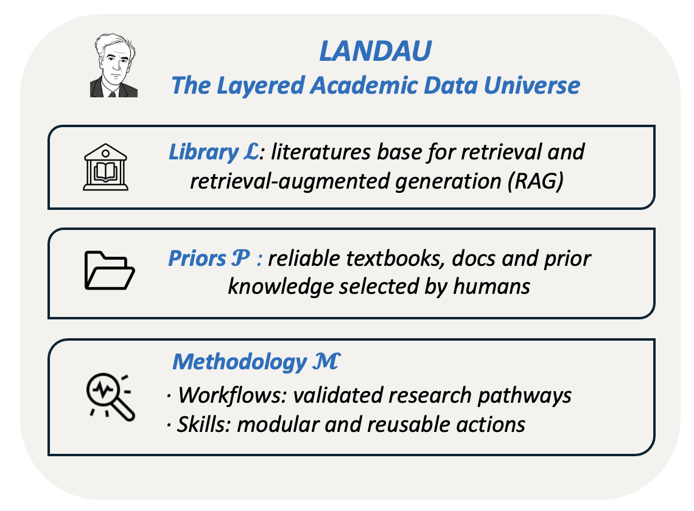

<div align="center">
<br>

<h1>PhysMaster</h1>

<p><strong>基于蒙特卡洛树搜索的 LLM 物理求解系统</strong></p>

<p>
<a href="https://python.org"></a>&nbsp;
<a href="#安装"></a>&nbsp;
<a href="LICENSE"></a>
</p>

<p><a href="README.md">English</a></p>

<br>
</div>

PhysMaster 将物理问题分解为子任务，通过 MCTS 搜索树**并行**探索多条求解路径，由 Critic 评估和优化，并在每个层级蒸馏可复用的知识 &mdash; 从单个节点到跨任务的 wisdom 知识库。

---

## 目录

- [架构](#架构)
- [安装](#安装)
- [快速开始](#快速开始)
- [配置参考](#配置参考)
- [核心概念](#核心概念)
  - [MCTS 搜索](#-mcts-搜索)
  - [记忆系统](#-记忆系统)
  - [先验知识库 (RAG)](#-先验知识库-rag)
  - [技能系统](#-技能系统)
  - [工作流模板](#-工作流模板)
- [项目结构](#项目结构)
- [飞书机器人](#-飞书机器人)
- [作为技能插件使用](#-作为技能插件使用claude-code--openclaw)
- [许可](#许可)

---

## 架构

<div align="center">
<table><tr>
<td width="60%"></td>
<td width="40%"></td>
</tr></table>
</div>

| Agent | 职责 |
|:------|:-----|
| **Clarifier** | 将原始问题解析为带有子任务的结构化合约 |
| **Supervisor** | 读取树上下文，选择下一个子任务，决定 draft 还是 revise |
| **Theoretician** | 求解子任务 &mdash; 可调用 Python、技能包、arXiv 论文检索和先验知识库 |
| **Critic** | 对解答打分（0&ndash;1）并做出判决：`complete` / `to_revise` / `to_redraft` |
| **Summarizer** | 从树中提取最优轨迹，生成 Markdown 报告 |

> 循环在某条路径完成所有子任务时终止，或在轮数预算耗尽时强制结束。

---

## 安装

> 需要 **Python 3.10+**

```bash
git clone https://github.com/AdrianMiao27/PHY_Master.git
cd PHY_Master
pip install -r requirements.txt
```

中国大陆用户可使用镜像加速：

```bash
pip install -r requirements.txt -i https://pypi.tuna.tsinghua.edu.cn/simple
```

编辑 `config.yaml`，填入 LLM 接口（任何 OpenAI 兼容 API）：

```yaml
llm:
  base_url: "https://api.openai.com/v1"
  api_key: "sk-..."
  model: "gpt-4o"
```

---

## 快速开始

**1. 编写问题** &mdash; 创建一个纯文本文件（支持 LaTeX）：

```
instructions/my_problem.txt
```

**2. 在配置中指向它：**

```yaml
pipeline:
  query_file: "instructions/my_problem.txt"
```

**3. 运行：**

```bash
python run.py                    # 默认 config.yaml
python run.py -c custom.yaml     # 自定义配置
```

**4. 查看结果** &mdash; 输出在 `outputs/<task_name>/`：

```
outputs/<task_name>/
 ├─ contract.json            结构化问题分解
 ├─ summary.md               最终求解报告
 ├─ visualization.html       交互式 MCTS 树（浏览器打开）
 ├─ log/                     详细日志（若启用 debug_logging）
 │   ├─ round_0.json           轮次级调度决策
 │   ├─ node_1/
 │   │   └─ node_log.json      节点 1 的输入/输出/评估
 │   └─ summary.json           树统计信息
 ├─ node_1/                  节点 1 的 Theoretician 工作目录
 ├─ node_2/                  ...
 └─ ...
```

> **最小模式** &mdash; 不使用任何外部知识源，设置 `skills.enabled: false` 以及所有 `landau.*_enabled: false` 即可。

---

## 配置参考

所有行为由 `config.yaml` 控制。只有 `llm` 和 `pipeline.query_file` 是必需的，其余都有默认值。

<details>
<summary><b>完整配置及注释</b>（点击展开）</summary>

```yaml
# ── LLM ──────────────────────────────────────────────
llm:
  base_url: "https://api.openai.com/v1"
  api_key: "sk-..."
  model: "gpt-4o"

# ── Pipeline ─────────────────────────────────────────
pipeline:
  query_file: "instructions/test.txt"
  output_path: "outputs"
  max_rounds: 10              # MCTS 轮数预算
  parallel_processes: 2       # 并行 Theoretician 进程数
  debug_logging: false        # 在 outputs/<task>/log/ 生成详细节点日志

# ── MCTS ─────────────────────────────────────────────
mcts:
  draft_expansion: 2          # 每次 draft 扩展的子节点数
  revise_expansion: 1         # 每次 revise 扩展的子节点数
  exploration_constant: 1.414 # UCB1 探索权重
  active_beam_width: 0        # 0 = 不剪枝；N = 每层保留 top-N

# ── Clarifier ────────────────────────────────────────
clarifier:
  max_key_concpets: 5

# ── 技能系统 ─────────────────────────────────────────
skills:
  enabled: true
  roots:
    - "LANDAU/skills"

# ── LANDAU 知识模块 ──────────────────────────────────
landau:
  library_enabled: true       # arXiv 论文检索
  library: "LANDAU/library"
  workflow_enabled: true       # 问题求解模板
  workflow: "LANDAU/workflow"
  prior_enabled: true          # FAISS RAG 知识库
  prior: "LANDAU/prior"
  wisdom_save_enabled: false   # 任务后持久化蒸馏知识

# ── 可视化 ───────────────────────────────────────────
visualization:
  enabled: true
```

</details>

| 参数 | 说明 | 默认值 |
|:----|:-----|:------|
| `pipeline.max_rounds` | MCTS 最大迭代轮数 | `10` |
| `pipeline.parallel_processes` | Theoretician 子进程数 | `2` |
| `pipeline.debug_logging` | 生成详细的节点级 JSON 日志 | `false` |
| `mcts.draft_expansion` | 每次 draft 扩展子节点数 | `2` |
| `mcts.revise_expansion` | 每次 revise 扩展子节点数 | `2` |
| `mcts.exploration_constant` | UCB1 探索系数 | `1.414` |
| `mcts.active_beam_width` | 束剪枝宽度（0 = 关闭） | `0` |

---

## 核心概念

### 🌳 MCTS 搜索

PhysMaster **不是**线性求解。它维护一棵解答尝试的搜索树，像下棋一样导航：

| 步骤 | 说明 |
|:-----|:-----|
| **选择** | UCB1 挑选最有潜力的叶节点，平衡奖励与探索 |
| **扩展** | 启动 N 个 Theoretician 并行求解，生成子节点 |
| **评估** | Critic 对每个子节点打分（0&ndash;1） |
| **反向传播** | 奖励向上流动；高奖励节点（&gt;0.8）将经过验证的知识强化到祖先节点 |
| **剪枝** | 若设置了束宽度，超额的低奖励节点被关闭 |

搜索在找到完整路径或达到 `max_rounds` 时终止。最优的根到叶路径被提取用于总结。

---

### 🧠 记忆系统

搜索树在多个范围内传递知识：

- **节点级经验** &nbsp; 每个节点存储完整的 Theoretician 输出 &mdash; 推理过程、工具调用、代码。Critic 评估时可以访问这些原始细节，评估后被压缩为知识。

- **压缩知识** &nbsp; 评估完成后，原始经验被蒸馏为简洁摘要并附加到节点上。当扩展新节点时，Supervisor 会从祖先摘要和兄弟分支的洞察中组装上下文，使后续尝试能够在先前分支所学的基础上继续推进。

- **跨任务智慧** &nbsp; 任务完成后，可选择让 LLM 将最优轨迹蒸馏为可复用的知识片段，写回 FAISS 先验索引。未来的任务可以像检索教材一样检索到这些智慧，形成持续改进的反馈闭环。

高奖励节点（&gt;0.8）触发*认知强化*：在反向传播时，其经过验证的知识会传播到祖先节点，提升同一分支上后续扩展的上下文质量。

---

### 📚 先验知识库 (RAG)

`LANDAU/prior/` 提供完整的检索增强生成管线：

| 阶段 | 文件 | 说明 |
|:-----|:-----|:-----|
| **摄入** | `prior_store.py` | PDF（MinerU）/ Markdown / Text &rarr; 父 chunk（4k 字符）&rarr; 子 chunk（1.2k 字符）&rarr; `bge-small-en-v1.5` 编码 &rarr; FAISS `IndexFlatIP` |
| **检索** | `prior_retrieve.py` | Dense + BM25，RRF 融合，加权重排序。可选 HyDE 提升召回 |
| **Wisdom** | `wisdom_store.py` | 任务后 LLM 蒸馏 &rarr; 新 chunk 追加到索引 |

**预构建知识库**：[PhysLib on HuggingFace](https://huggingface.co/datasets/Kev1n-J1N/PhysLib) — 来自 74 本物理教材的 78k chunks（朗道全集、Weinberg QFT、弦论、凝聚态、GR/宇宙学等）

```bash
# 将源文件放入 LANDAU/prior/source/，然后：
python LANDAU/prior/prior_store.py                             # 摄入全部
python LANDAU/prior/prior_store.py --target path/to/file.pdf   # 单个文件
python LANDAU/prior/prior_store.py --reset                     # 完全重建
```

配置启用：

```yaml
landau:
  prior_enabled: true
  wisdom_save_enabled: true   # 可选：持久化跨任务智慧
```

---

### 🔧 技能系统

`LANDAU/skills/` 中的领域知识包。每个技能是一个含 `SKILL.md` 的目录（YAML 头 + 方法论正文）。Theoretician 可以看到所有已安装技能的摘要，求解时按需加载完整内容。

<details>
<summary><b>12 个内置技能</b></summary>

| 技能 | 覆盖领域 |
|:-----|:---------|
| 经典电动力学 | 麦克斯韦方程、辐射、波导 |
| 量子力学 | 薛定谔方程、散射、角动量 |
| 热力学与统计力学 | 配分函数、相变、系综 |
| 守恒律 | 诺特定理、守恒流 |
| 微扰展开 | 正则/奇异微扰、渐近级数 |
| 变分方法 | 欧拉-拉格朗日、瑞利-里兹 |
| 量纲分析 | Pi 定理、自然单位、标度律 |
| 对称性分析 | 群论、李代数、表示论 |
| 傅里叶与谱分析 | 傅里叶/拉普拉斯变换、谱方法 |
| 数值 ODE/PDE | 龙格-库塔、有限差分/有限元 |
| 统计误差分析 | 误差传播、拟合、蒙特卡洛 |
| LaMET 渐近展开 | 大动量有效理论 |

</details>

---

### 📋 工作流模板

`LANDAU/workflow/` 中的 YAML 文件，为特定问题类型定义结构化求解策略。Clarifier 通过查询与工作流 Goal 字段的关键词重叠来匹配模板，用以生成更好的子任务分解。

```yaml
landau:
  workflow_enabled: true
  workflow: "LANDAU/workflow"
```

---

## 项目结构

```
PHY_Master/
│
├── run.py                       入口
├── config.yaml                  配置
├── requirements.txt
│
├── core/                        核心 pipeline
│   ├── clarifier.py               问题 → 结构化合约
│   ├── supervisor.py              MCTS 编排器
│   ├── mcts.py                    MCTSNode / MCTSTree
│   ├── theoretician.py            求解 agent（子进程）
│   ├── summarizer.py              轨迹 → Markdown 报告
│   └── visualization.py           搜索树 → 交互式 HTML
│
├── LANDAU/                      知识模块
│   ├── skills/                    12 个内置物理技能
│   ├── workflow/                  求解策略 YAML 模板
│   ├── library/                   arXiv 论文检索
│   └── prior/                     FAISS RAG 知识库
│       ├── prior_store.py           摄入管线
│       ├── prior_retrieve.py        混合检索器
│       └── wisdom_store.py          跨任务智慧持久化
│
├── utils/                       工具
│   ├── llm_client.py              OpenAI 兼容 API 封装
│   ├── python_utils.py            子进程代码执行
│   ├── skill_loader.py            SKILL.md 发现与加载
│   └── tool_schemas.py            工具定义
│
├── prompts/                     14 个 prompt 模板（7 个 agent）
├── instructions/                问题文件
├── feishu/                      飞书机器人集成
└── outputs/                     运行时生成
```

---

## 🤖 飞书机器人

PhysMaster 可作为**飞书（Lark）聊天机器人**运行。在聊天中发送物理题 &rarr; 机器人回复「正在求解…」 &rarr; 后台线程运行 pipeline &rarr; 完成后推送 summary。

详见 **[feishu/README.md](feishu/README.md)**。

---

## 🔌 作为技能插件使用（Claude Code / OpenClaw）

PhysMaster 可以作为 **skill 插件**安装到 AI agent 平台。安装后，agent 可以调用 PhysMaster 求解物理问题、搜索 arXiv 或运行完整 MCTS 管线 — 无需在项目目录内。

技能包位于 `extensions/skills/physmaster/`，包含文档、参考指南和可执行脚本。

### Claude Code

```bash
bash extensions/skills/physmaster/install_cc.sh
```

这会将技能复制到 `~/.claude/commands/physmaster.md`。之后在任意 Claude Code 会话中输入 `/physmaster` 即可加载技能上下文。

### OpenClaw

```bash
bash extensions/skills/physmaster/install_openclaw.sh /path/to/evomaster/skills
```

这会将完整技能包复制到 OpenClaw 的 skills 目录。然后在 agent 配置中：

```yaml
agents:
  my_agent:
    skills: ["physmaster"]
```

Agent 可以使用：

```
use_skill(name="physmaster", action="get_info")
use_skill(name="physmaster", action="run_script", path="run_physmaster.py --query '...'")
```

详见 **[extensions/README.md](extensions/README.md)**。

---

## 💬 交流群

欢迎加入微信群，交流物理求解、分享结果、反馈问题：

<div align="center">

<p><i>扫码加入微信交流群</i></p>
</div>

---

## 许可

[MIT](LICENSE)
