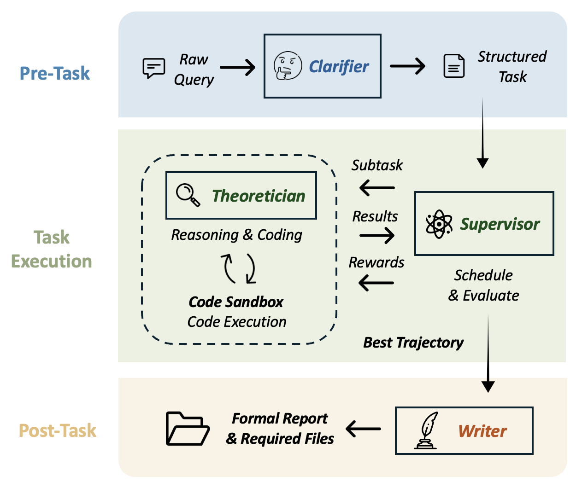

<div align="center">
<br>

<h1>🔬 PhysMaster</h1>

<p><strong>基于蒙特卡洛树搜索的 LLM 物理求解系统</strong></p>

<p>
<a href="https://python.org"></a>&nbsp;
<a href="#-快速上手"></a>&nbsp;
<a href="LICENSE"></a>&nbsp;
</p>

<p>
<a href="README.md">English</a> ·
📄 论文:&nbsp;<a href="https://arxiv.org/abs/2512.19799"></a>
</p>

<br>
</div>

PhysMaster 将物理问题分解为子任务，通过 MCTS 搜索树**并行**探索多条求解路径，由 Critic 评估和优化，并在每个层级蒸馏可复用的知识 &mdash; 从单个节点到跨任务的 wisdom 知识库。

## 📋 核心特性

- **MCTS 驱动搜索**：并行探索多条求解路径，通过 UCB1 平衡开发与探索
- **多智能体管线**：5 个专业 Agent（Clarifier → Supervisor → Theoretician → Critic → Summarizer）在结构化循环中协作
- **分层记忆系统**：节点级经验 → 压缩知识 → 跨任务智慧，高奖励路径触发认知强化
- **LANDAU 知识层**：74 本物理教材 RAG 检索、实时 arXiv 搜索、12 个领域技能包、工作流模板
- **最小配置**：仅需 `llm` + `pipeline.query_file`，其余均有合理默认值

---

## 🏗 架构

<div align="center">

</div>

| 组件 | 职责 |
|:------|:-----|
| 🔍 **Clarifier** | 将原始问题解析为带有子任务的结构化合约 |
| 🎯 **Supervisor** | 读取树上下文，选择下一个子任务，决定 draft 还是 revise |
| ⚡ **Theoretician** | 求解子任务 &mdash; 可调用 Python、技能包、arXiv 论文检索和先验知识库 |
| 🧪 **Critic** | 对解答打分（0&ndash;1）并做出判决：`complete` / `to_revise` / `to_redraft` |
| 📄 **Summarizer** | 从树中提取最优轨迹，生成 Markdown 报告 |
| 📦 **LANDAU** | 外部知识层 &mdash; 提供先验 RAG 检索、arXiv 搜索、领域技能包和工作流模板 |

> 循环在某条路径完成所有子任务时终止，或在轮数预算耗尽时强制结束。

---

## 🚀 快速上手

> 需要 **Python 3.10+** 和一个 OpenAI 兼容的 LLM API Key

```bash
# 1. 安装
git clone https://github.com/AdrianMiao27/PHY_Master.git
cd PHY_Master
pip install -r requirements.txt
# 中国大陆用户: pip install -r requirements.txt -i https://pypi.tuna.tsinghua.edu.cn/simple

# 2. 配置 — 编辑 config.yaml
#    llm.base_url / api_key / model  +  pipeline.query_file

# 3. 运行
python run.py                    # 默认 config.yaml
python run.py -c custom.yaml     # 自定义配置
```

输出在 `outputs/<task_name>/` — 包含 `summary.md`、`visualization.html`（交互式 MCTS 树）和各节点工作目录。

> 💡 **最小模式** — 不使用外部知识：设置 `skills.enabled: false` 以及所有 `landau.*_enabled: false`。

<details>
<summary><b>⚙ 完整配置参考</b></summary>

```yaml
# ── LLM ──────────────────────────────────────────────
llm:
  base_url: "https://api.openai.com/v1"
  api_key: "sk-..."
  model: "gpt-4o"

# ── Pipeline ─────────────────────────────────────────
pipeline:
  query_file: "instructions/test.txt"
  output_path: "outputs"
  max_rounds: 10              # MCTS 轮数预算
  parallel_processes: 2       # 并行 Theoretician 进程数
  debug_logging: false        # 在 outputs/<task>/log/ 生成详细节点日志

# ── MCTS ─────────────────────────────────────────────
mcts:
  draft_expansion: 2          # 每次 draft 扩展的子节点数
  revise_expansion: 1         # 每次 revise 扩展的子节点数
  exploration_constant: 1.414 # UCB1 探索权重
  active_beam_width: 0        # 0 = 不剪枝；N = 每层保留 top-N

# ── Clarifier ────────────────────────────────────────
clarifier:
  max_key_concpets: 5

# ── 技能系统 ─────────────────────────────────────────
skills:
  enabled: true
  roots:
    - "LANDAU/skills"

# ── LANDAU 知识模块 ──────────────────────────────────
landau:
  library_enabled: true       # arXiv 论文检索
  library: "LANDAU/library"
  workflow_enabled: true       # 问题求解模板
  workflow: "LANDAU/workflow"
  prior_enabled: true          # FAISS RAG 知识库
  prior: "LANDAU/prior"
  wisdom_save_enabled: false   # 任务后持久化蒸馏知识

# ── 可视化 ───────────────────────────────────────────
visualization:
  enabled: true
```

**关键参数：**

| 参数 | 说明 | 默认值 |
|:----|:-----|:------:|
| `pipeline.max_rounds` | MCTS 最大迭代轮数 | `10` |
| `pipeline.parallel_processes` | Theoretician 子进程数 | `2` |
| `pipeline.debug_logging` | 生成详细的节点级 JSON 日志 | `false` |
| `mcts.draft_expansion` | 每次 draft 扩展子节点数 | `2` |
| `mcts.revise_expansion` | 每次 revise 扩展子节点数 | `2` |
| `mcts.exploration_constant` | UCB1 探索系数 | `1.414` |
| `mcts.active_beam_width` | 束剪枝宽度（0 = 关闭） | `0` |

</details>

---

## 🌳 核心方法

### MCTS 搜索

PhysMaster **不是**线性求解。它维护一棵解答尝试的搜索树，像下棋一样导航：

| 步骤 | 说明 |
|:-----|:-----|
| **选择** | UCB1 挑选最有潜力的叶节点，平衡奖励与探索 |
| **扩展** | 启动 N 个 Theoretician 并行求解，生成子节点 |
| **评估** | Critic 对每个子节点打分（0&ndash;1） |
| **反向传播** | 奖励向上流动；高奖励节点（&gt;0.8）将经过验证的知识强化到祖先节点 |
| **剪枝** | 若设置了束宽度，超额的低奖励节点被关闭 |

搜索在找到完整路径或达到 `max_rounds` 时终止。最优的根到叶路径被提取用于总结。

### 记忆系统

搜索树在**三个范围**内传递知识：

| 范围 | 说明 |
|:-----|:-----|
| **🔬 节点级经验** | 完整的 Theoretician 输出 — 推理过程、工具调用、代码。供 Critic 评估后压缩。 |
| **📦 压缩知识** | 蒸馏为简洁摘要附加到节点。祖先和兄弟通过树上下文共享洞察。 |
| **🌐 跨任务智慧** | 任务完成后，最优轨迹蒸馏并写回 FAISS 索引，供未来任务检索。 |

> 高奖励节点（&gt;0.8）触发**认知强化**：经过验证的知识在反向传播时传播到祖先节点。

---

## 📦 LANDAU 知识系统

`LANDAU/` 目录提供外部知识层，为 Theoretician 的领域专业能力提供支撑。

| 模块 | 路径 | 说明 |
|:-----|:-----|:-----|
| **📚 先验知识 (RAG)** | `LANDAU/prior/` | PDF/MD/Text → 父子 chunk → `bge-small-en-v1.5` → FAISS 索引。Dense + BM25 混合检索，RRF 融合。 |
| **🔎 Library** | `LANDAU/library/` | 求解时实时搜索和检索 arXiv 论文。 |
| **🔧 技能包** | `LANDAU/skills/` | 12 个领域知识包 — Theoretician 按需加载。 |
| **📋 工作流** | `LANDAU/workflow/` | YAML 求解模板 — Clarifier 通过关键词匹配自动选择。 |

**预构建知识库**：[PhysLib on HuggingFace](https://huggingface.co/datasets/Kev1n-J1N/PhysLib) — 来自 74 本物理教材的 78k chunks。

<details>
<summary><b>摄入命令</b></summary>

```bash
python LANDAU/prior/prior_store.py                             # 摄入全部
python LANDAU/prior/prior_store.py --target path/to/file.pdf   # 单个文件
python LANDAU/prior/prior_store.py --reset                     # 完全重建
```

</details>

<details>
<summary><b>12 个内置技能</b></summary>

| 技能 | 覆盖领域 |
|:-----|:---------|
| 经典电动力学 | 麦克斯韦方程、辐射、波导 |
| 量子力学 | 薛定谔方程、散射、角动量 |
| 热力学与统计力学 | 配分函数、相变、系综 |
| 守恒律 | 诺特定理、守恒流 |
| 微扰展开 | 正则/奇异微扰、渐近级数 |
| 变分方法 | 欧拉-拉格朗日、瑞利-里兹 |
| 量纲分析 | Pi 定理、自然单位、标度律 |
| 对称性分析 | 群论、李代数、表示论 |
| 傅里叶与谱分析 | 傅里叶/拉普拉斯变换、谱方法 |
| 数值 ODE/PDE | 龙格-库塔、有限差分/有限元 |
| 统计误差分析 | 误差传播、拟合、蒙特卡洛 |
| LaMET 渐近展开 | 大动量有效理论 |

</details>

---

## 🔌 集成

| 平台 | 用法 |
|:-----|:-----|
| **🤖 飞书机器人** | 在聊天中发送物理题 → 后台运行 pipeline → 完成后推送 summary。详见 [feishu/README.md](feishu/README.md)。 |
| **🧩 Claude Code** | `bash extensions/skills/physmaster/install_cc.sh` → 在任意会话中输入 `/physmaster`。 |
| **🧩 OpenClaw** | `bash extensions/skills/physmaster/install_openclaw.sh /path/to/skills` → `use_skill(name="physmaster", ...)`。 |

详见 **[extensions/README.md](extensions/README.md)**。

---

## 📁 项目结构

```
PHY_Master/
├── run.py                       入口
├── config.yaml                  配置
├── requirements.txt
├── core/                        核心 pipeline
│   ├── clarifier.py               问题 → 结构化合约
│   ├── supervisor.py              MCTS 编排器
│   ├── mcts.py                    MCTSNode / MCTSTree
│   ├── theoretician.py            求解 agent（子进程）
│   ├── summarizer.py              轨迹 → Markdown 报告
│   └── visualization.py           搜索树 → 交互式 HTML
├── LANDAU/                      知识模块
│   ├── skills/                    12 个内置物理技能
│   ├── workflow/                  求解策略 YAML 模板
│   ├── library/                   arXiv 论文检索
│   └── prior/                     FAISS RAG 知识库
├── utils/                       工具
├── prompts/                     14 个 prompt 模板（7 个 agent）
├── instructions/                问题文件
├── extensions/                  技能插件（CC / OpenClaw）
├── feishu/                      飞书机器人集成
└── outputs/                     运行时生成
```

---

## 💬 交流群

<div align="center">

<br><em>扫码加入微信交流群</em>
</div>

---

## 📄 引用

如果 PhysMaster 对你的研究有帮助，请引用：

```bibtex
@misc{miao2025physmaster,
      title={PhysMaster: Building an Autonomous AI Physicist for Theoretical and Computational Physics Research},
      author={Tingjia Miao and Jiawen Dai and Jingkun Liu and Jinxin Tan and Muhua Zhang and Wenkai Jin and Yuwen Du and Tian Jin and Xianghe Pang and Zexi Liu and Tu Guo and Zhengliang Zhang and Yunjie Huang and Shuo Chen and Rui Ye and Yuzhi Zhang and Linfeng Zhang and Kun Chen and Wei Wang and Weinan E and Siheng Chen},
      year={2025},
      eprint={2512.19799},
      archivePrefix={arXiv},
      primaryClass={cs.AI},
      url={https://arxiv.org/abs/2512.19799},
}
```

---

## 许可

[MIT](LICENSE)
